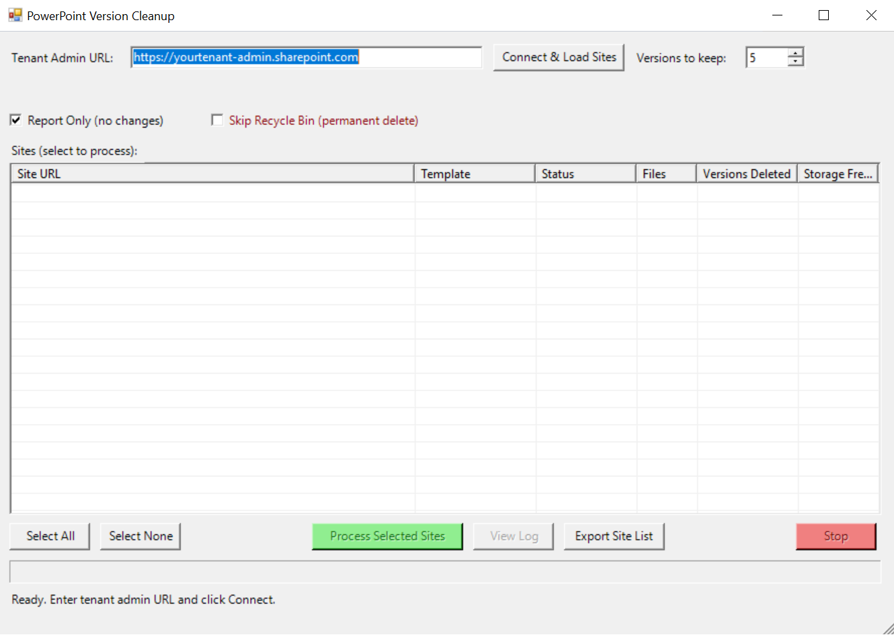

# Limit-PowerPointVersions

Limits version history for PowerPoint documents across all SharePoint sites in your tenant. This script helps free up storage by trimming excessive version history while keeping a configurable number of recent versions.

## Use Cases

- Reducing SharePoint storage costs by cleaning up old PowerPoint versions
- Enforcing version retention policies across the tenant
- One-time cleanup before implementing library-level version limits
- Auditing how much storage is consumed by PowerPoint version history

## Requirements

### PowerShell Modules

```powershell
Install-Module -Name PnP.PowerShell -Force -Scope CurrentUser
```

### Permissions

| Permission | Purpose |
|------------|---------|
| SharePoint Administrator | Required to enumerate all sites via `Get-PnPTenantSite` |
| Site Collection Administrator | Required for each site to access document libraries and delete versions |

For app-only authentication, register an Azure AD app with:
- `Sites.FullControl.All` application permission
- Certificate-based authentication

## How It Works

1. Connects to SharePoint tenant admin center
2. Enumerates all SharePoint sites (excluding system sites, OneDrive, etc.)
3. Filters sites based on include/exclude lists if specified
4. For each site, finds all document libraries
5. Uses **server-side CAML queries** to efficiently find PowerPoint files (.pptx, .ppt)
6. Sorts versions by **Created date** (most reliable method)
7. For files with more versions than the limit, deletes oldest versions
8. By default, deleted versions go to the site recycle bin (recoverable)

## Usage

### Step 1: Report Only (Recommended First Step)

Generate a CSV report without making any changes:

```powershell
.\Limit-PowerPointVersions.ps1 -TenantAdminUrl "https://contoso-admin.sharepoint.com" -MajorVersionsToKeep 5 -ReportOnly
```

This creates a CSV with:
- Every file that would be affected
- Number of versions to delete per file
- Estimated storage savings per file
- **No changes are made**

### Step 2: Preview (WhatIf Mode)

See what would happen in the console:

```powershell
.\Limit-PowerPointVersions.ps1 -TenantAdminUrl "https://contoso-admin.sharepoint.com" -MajorVersionsToKeep 5 -WhatIf
```

### Step 3: Test on a Single Site

Before running tenant-wide, test on one site:

```powershell
.\Limit-PowerPointVersions.ps1 -TenantAdminUrl "https://contoso-admin.sharepoint.com" -MajorVersionsToKeep 5 -IncludeSites "https://contoso.sharepoint.com/sites/TestSite"
```

### Step 4: Execute Tenant-Wide

```powershell
.\Limit-PowerPointVersions.ps1 -TenantAdminUrl "https://contoso-admin.sharepoint.com" -MajorVersionsToKeep 5
```

You'll be prompted for confirmation due to `ConfirmImpact = "High"`.

### Excluding Sensitive Sites

Exclude HR, Legal, and other sensitive sites:

```powershell
.\Limit-PowerPointVersions.ps1 -TenantAdminUrl "https://contoso-admin.sharepoint.com" -MajorVersionsToKeep 5 -ExcludeSites "*HR*", "*Legal*", "*Compliance*", "*Executive*"
```

## Parameters

| Parameter | Required | Default | Description |
|-----------|----------|---------|-------------|
| `-TenantAdminUrl` | Yes | - | SharePoint admin URL (e.g., `https://contoso-admin.sharepoint.com`) |
| `-MajorVersionsToKeep` | No | 5 | Number of versions to retain (1-500) |
| `-ClientId` | No | - | Azure AD app client ID for app-only auth |
| `-CertificatePath` | No | - | Path to .pfx certificate for app-only auth |
| `-CertificatePassword` | No | - | Password for the certificate (SecureString) |
| `-SkipRecycleBin` | No | $false | Permanently delete versions (bypasses recycle bin) |
| `-LogDirectory` | No | Script dir | Directory for log files |
| `-ThrottleDelayMs` | No | 500 | Delay between site connections to avoid throttling |
| `-IncludeSites` | No | - | Array of specific site URLs to process (only these) |
| `-ExcludeSites` | No | - | Array of URL patterns to exclude (wildcards supported) |
| `-ReportOnly` | No | $false | Generate report without making changes |
| `-WhatIf` | No | - | Preview mode - shows what would happen |
| `-Confirm` | No | $true | Prompts before making changes |

## Important Impact Information

### User Impact

| Aspect | Impact |
|--------|--------|
| **File Availability** | Users can continue working while script runs. No file locks. |
| **Modified Date** | Deleting versions does NOT change "Modified Date" or "Modified By" of the live file. |
| **Data Loss Risk** | If a user needed a specific old version, it will be gone (or in recycle bin). |
| **Recycle Bin Noise** | Site recycle bins may be flooded with thousands of version entries, making it harder to find accidentally deleted files. |

### Admin Impact

| Aspect | Impact |
|--------|--------|
| **Audit Logs** | Generates massive "Delete" events in M365 Unified Audit Log. Plan for this. |
| **Storage Quota** | You won't see savings immediately. SharePoint metrics update every 24-48 hours. |
| **Recycle Bin Storage** | Items in recycle bin still count against site quota for up to 93 days. |
| **Throttling** | Microsoft may throttle if processing too fast. Use `-ThrottleDelayMs` to control. |

### When to Empty Recycle Bins

If you need immediate storage relief:
1. Run the cleanup script
2. Wait for it to complete
3. Empty site collection recycle bins (this is a separate operation)

```powershell
# Example: Empty recycle bin for a site
Connect-PnPOnline -Url "https://contoso.sharepoint.com/sites/MySite" -Interactive
Clear-PnPRecycleBinItem -All -Force
```

## Technical Details

### Server-Side Filtering (CAML)

The script uses CAML queries to filter PowerPoint files on the SharePoint server:

```xml
<View Scope='RecursiveAll'>
    <Query>
        <Where>
            <Or>
                <Eq><FieldRef Name='File_x0020_Type'/><Value Type='Text'>pptx</Value></Eq>
                <Eq><FieldRef Name='File_x0020_Type'/><Value Type='Text'>ppt</Value></Eq>
            </Or>
        </Where>
    </Query>
</View>
```

This reduces network traffic by ~90% compared to downloading all items and filtering client-side.

### Version Sorting

Versions are sorted by **Created date** (descending), not by parsing version labels. This is more reliable because:
- Version labels can have unexpected formats (1.0, 1.1, 2.0, etc.)
- Draft versions may have minor numbers
- Created date is always accurate regardless of label format

### Large List Handling

- Uses `-PageSize 2000` for pagination
- Falls back to client-side filtering if CAML query fails (e.g., Large List Resource Quota issues)
- Each site connection includes configurable throttle delay

## Output Files

The script generates:

| File | Description |
|------|-------------|
| `PowerPoint-VersionCleanup-[timestamp].log` | Detailed execution log |
| `PowerPoint-VersionCleanup-[timestamp]-Report.csv` | CSV with all affected files (always generated) |

### Report CSV Columns

| Column | Description |
|--------|-------------|
| SiteUrl | SharePoint site URL |
| Library | Document library name |
| FileName | PowerPoint file name |
| FileUrl | Full path to file |
| TotalVersions | Current number of versions |
| VersionsToDelete | How many would be/were deleted |
| VersionsToKeep | Configured retention count |
| EstimatedSizeBytes | Bytes that would be/were freed |
| EstimatedSize | Human-readable size |

## App-Only Authentication

For unattended/scheduled execution, use certificate-based authentication:

### 1. Create a Self-Signed Certificate

```powershell
$cert = New-SelfSignedCertificate -Subject "CN=PowerPointVersionCleanup" `
    -CertStoreLocation "Cert:\CurrentUser\My" `
    -KeyExportPolicy Exportable `
    -KeySpec Signature `
    -KeyLength 2048 `
    -KeyAlgorithm RSA `
    -HashAlgorithm SHA256 `
    -NotAfter (Get-Date).AddYears(2)

# Export PFX (for script)
$pwd = ConvertTo-SecureString -String "YourPassword" -Force -AsPlainText
Export-PfxCertificate -Cert $cert -FilePath ".\PowerPointCleanup.pfx" -Password $pwd

# Export CER (for Azure AD)
Export-Certificate -Cert $cert -FilePath ".\PowerPointCleanup.cer"
```

### 2. Register Azure AD App

1. Go to Azure Portal > Azure Active Directory > App registrations
2. New registration: "PowerPoint Version Cleanup"
3. API permissions > Add: SharePoint > Application > `Sites.FullControl.All`
4. Grant admin consent
5. Certificates & secrets > Upload the .cer file

### 3. Run with App-Only Auth

```powershell
$certPassword = Read-Host -AsSecureString "Enter certificate password"

.\Limit-PowerPointVersions.ps1 `
    -TenantAdminUrl "https://contoso-admin.sharepoint.com" `
    -MajorVersionsToKeep 5 `
    -ClientId "your-app-client-id" `
    -CertificatePath ".\PowerPointCleanup.pfx" `
    -CertificatePassword $certPassword `
    -Confirm:$false
```

## Example Output

```
[2026-01-21 14:30:22] [INFO] === PowerPoint Version History Cleanup Script ===
[2026-01-21 14:30:22] [INFO] Configuration: Keep 5 versions per file
[2026-01-21 14:30:22] [INFO] Recycle Bin: Enabled - Versions sent to recycle bin
[2026-01-21 14:30:22] [INFO] Throttle Delay: 500 ms between sites
[2026-01-21 14:30:22] [INFO] Exclude Patterns: *HR*, *Legal*
[2026-01-21 14:30:25] [SUCCESS] Successfully connected to tenant admin
[2026-01-21 14:30:28] [INFO] Found 47 sites (before include/exclude filtering)
[2026-01-21 14:30:30] [INFO] === [1/47] Processing Site: https://contoso.sharepoint.com/sites/Marketing ===
[2026-01-21 14:30:32] [INFO] Site has 3 document libraries
[2026-01-21 14:30:33] [INFO] Library 'Documents': Found 12 PowerPoint files
[2026-01-21 14:30:35] [INFO] File 'Q4 Presentation.pptx': recycle 8 of 13 versions (kept newest 5) - 24.5 MB
...
========================================
         EXECUTION SUMMARY              
========================================
[2026-01-21 15:45:12] [SUMMARY] Sites Processed:                 42
[2026-01-21 15:45:12] [SUMMARY] Sites Skipped (excluded):        5
[2026-01-21 15:45:12] [SUMMARY] Libraries Processed:             89
[2026-01-21 15:45:12] [SUMMARY] PowerPoint Files Scanned:        234
[2026-01-21 15:45:12] [SUMMARY] Files with Excess Versions:      67
[2026-01-21 15:45:12] [SUMMARY] Versions Deleted:                412
[2026-01-21 15:45:12] [SUMMARY] Storage Freed:                   1.24 GB
[2026-01-21 15:45:12] [SUMMARY] Errors Encountered:              2
========================================
[2026-01-21 15:45:12] [INFO] Log file: .\PowerPoint-VersionCleanup-20260121-143022.log
[2026-01-21 15:45:12] [INFO] Report exported: .\PowerPoint-VersionCleanup-20260121-143022-Report.csv
========================================

[2026-01-21 15:45:12] [WARNING] IMPORTANT NOTES:
[2026-01-21 15:45:12] [WARNING] - Deleted versions are in site recycle bins (93 day retention)
[2026-01-21 15:45:12] [WARNING] - Recycle bin items still count against storage quota
[2026-01-21 15:45:12] [WARNING] - Consider emptying recycle bins to reclaim storage immediately
[2026-01-21 15:45:12] [WARNING] - Storage metrics update every 24-48 hours
[2026-01-21 15:45:12] [WARNING] - Check M365 Unified Audit Log for 'Delete' events
```

## Troubleshooting

### "Access denied" on specific sites

Your account needs at least Site Collection Administrator on each site. For app-only auth, ensure `Sites.FullControl.All` is granted.

### "Throttled" or 429 errors

Increase `-ThrottleDelayMs` to 2000 or higher, or run during off-peak hours.

### CAML query warnings

If you see "CAML query failed, falling back to client-side filtering", this usually means:
- The library has more than 5,000 items (Large List Threshold)
- The File_x0020_Type column isn't indexed

The script will still work but will be slower for that library.

### Script hangs on large library

Large libraries with thousands of files take time to enumerate. The script uses pagination (2000 items/page) to handle this efficiently.

### Certificate errors with app-only auth

Ensure:
1. Both `-ClientId` and `-CertificatePath` are provided
2. Certificate file exists and password is correct
3. Certificate is uploaded to the Azure AD app registration

## Future Enhancements (Not Yet Implemented)

- **Parallel Processing**: PowerShell 7+ `ForEach-Object -Parallel` for processing multiple sites simultaneously
- **Checkpoint/Resume**: Save progress to resume after failures
- **PnP Batch Operations**: Use batching for version deletions

## Batch Processing & GUI

For large tenants, two helper scripts are provided:

### GUI (Interactive)

Launch a simple Windows Forms GUI to select and process sites interactively:

```powershell
.\Start-CleanupGUI.ps1
```

**Features:**
- Connect to tenant and load all sites
- Checkbox selection for which sites to process
- Real-time progress and status per site
- "View Log" button to see results for completed sites
- Export site list to file
- Stop button to halt processing



### Batch Wrapper (Automation)

Process sites from a file (useful for splitting work across machines/windows):

```powershell
# Create a file with site URLs (one per line)
# sites.txt:
# https://contoso.sharepoint.com/sites/Marketing
# https://contoso.sharepoint.com/sites/Sales
# https://contoso.sharepoint.com/sites/Engineering

# Run batch processing
.\Invoke-BatchCleanup.ps1 -SiteListPath ".\sites.txt" -TenantAdminUrl "https://contoso-admin.sharepoint.com" -ReportOnly
```

**Features:**
- Reads sites from .txt (one URL per line) or .csv (with "Url" column)
- Processes each site individually
- Optional batch size with pause between batches
- Creates summary CSV with results
- Individual logs per site in timestamped folder

**Parameters:**

| Parameter | Description |
|-----------|-------------|
| `-SiteListPath` | Path to .txt or .csv with site URLs |
| `-TenantAdminUrl` | Tenant admin URL |
| `-BatchSize` | Sites per batch before pausing (0 = no batching) |
| `-ReportOnly` | Only generate reports |
| `-SkipRecycleBin` | Permanent deletion |

**Example: Split work across 3 terminal windows**

```powershell
# Terminal 1: Sites 1-100
.\Invoke-BatchCleanup.ps1 -SiteListPath ".\sites-batch1.txt" -TenantAdminUrl "https://contoso-admin.sharepoint.com"

# Terminal 2: Sites 101-200
.\Invoke-BatchCleanup.ps1 -SiteListPath ".\sites-batch2.txt" -TenantAdminUrl "https://contoso-admin.sharepoint.com"

# Terminal 3: Sites 201-300
.\Invoke-BatchCleanup.ps1 -SiteListPath ".\sites-batch3.txt" -TenantAdminUrl "https://contoso-admin.sharepoint.com"
```

## Scheduling

To run on a schedule (e.g., monthly cleanup):

### Windows Task Scheduler

```powershell
# Create scheduled task
$action = New-ScheduledTaskAction -Execute "PowerShell.exe" `
    -Argument "-ExecutionPolicy Bypass -File `"C:\Scripts\Limit-PowerPointVersions.ps1`" -TenantAdminUrl `"https://contoso-admin.sharepoint.com`" -MajorVersionsToKeep 5 -ClientId `"app-id`" -CertificatePath `"C:\Scripts\cert.pfx`" -ExcludeSites `"*HR*`",`"*Legal*`" -Confirm:`$false"

$trigger = New-ScheduledTaskTrigger -Weekly -DaysOfWeek Sunday -At 2am

Register-ScheduledTask -TaskName "PowerPoint Version Cleanup" -Action $action -Trigger $trigger
```

## License

MIT License
